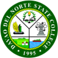

# DNSC E-Request Management System



## Overview

The DNSC E-Request Management System is a comprehensive web-based application designed to streamline document requests and appointment processes for the College Registrar at Davao del Norte State College. This system enables students and alumni to submit, track, and manage document requests online, eliminating the need to physically visit the office until document pickup.

## Key Features

- **Online Request Submission**: Submit requests for various documents, certificates, and transcripts electronically
- **Real-time Status Tracking**: Monitor request progress from submission to completion
- **Notification System**: Receive instant updates on request status changes and approvals
- **Transaction History**: Access complete history of past and ongoing document requests
- **Scheduled Pickup**: Get assigned pickup dates for document collection
- **Secure Role-based Access**: Separate interfaces for students and administrative staff

## Technology Stack

- **Frontend**: HTML, CSS, Bootstrap 5, JavaScript
- **Backend**: PHP
- **Database**: MySQL
- **UI Theme**: Custom green theme with responsive design

## User Roles and Capabilities

### Students/Alumni
- Submit new document requests
- Track status of pending requests
- Receive notifications for status updates
- View and print request receipts
- Maintain transaction history

### Administrators
- Review and process incoming requests
- Update request statuses (approve, reject, complete)
- Schedule pickup dates for completed documents
- Manage notification system
- View analytics and reports

## System Workflow

1. Student logs in and submits a document request
2. Admin reviews and processes the request
3. Student makes payment at the cashier
4. Admin marks request as completed when ready
5. Student receives notification for document pickup
6. Student collects document from the Registrar's office

## Installation Guide

### Prerequisites
- PHP 7.4 or higher
- MySQL 5.7 or higher
- Web server (Apache/Nginx)

### Setup Instructions
1. Clone the repository:
   ```
   git clone https://github.com/yourusername/dnsc-erequest-system.git
   ```
2. Import the database schema:
   ```
   mysql -u username -p < database.sql
   ```
3. Configure database connection in `config.php`
4. Set up your web server to point to the project directory
5. Access the system through your web browser

### Default Admin Access
- Username: admin
- Password: password
- **Important**: Change the default password after first login

## Project Structure

```
DNSC-E-Request-System/
├── admin/               # Administration panel
│   ├── dashboard.php
│   ├── view_request.php
│   └── ...
├── student/             # Student portal
│   ├── dashboard.php
│   ├── new_request.php
│   ├── view_request.php
│   └── ...
├── assets/              # Static resources
│   ├── css/
│   │   └── green-theme.css
│   └── img/
├── config.php           # Database and system configuration
├── login.php            # Authentication
├── register.php         # User registration
├── index.php            # Landing page
├── database.sql         # Database schema
└── README.md            # System documentation
```

## Benefits and Impact

- **Time Efficiency**: Reduces processing time for document requests
- **Accessibility**: 24/7 access to request submission
- **Transparency**: Clear visibility into request status
- **Resource Optimization**: Minimizes paperwork and administrative overhead
- **User Experience**: Improved service delivery for students and alumni

## Development Team

- **Christian Duran** - Project Leader
- **John Lyold C. Lozada** - Backend Developer
- **Arjean G. Logrosa** - Frontend Developer
- **Stephanie Kate O. Losabia** - UI/UX Designer

## License & Copyright

© 2025 DNSC E-Request Management System. All rights reserved.

This project is developed for Davao del Norte State College and is not licensed for distribution or use outside the institution without explicit permission.

## Contact

For inquiries or support regarding this system, please contact:
- Email: lozadajohnlyold@dnsc.edu.ph
- Phone: +63 951 229 7022
